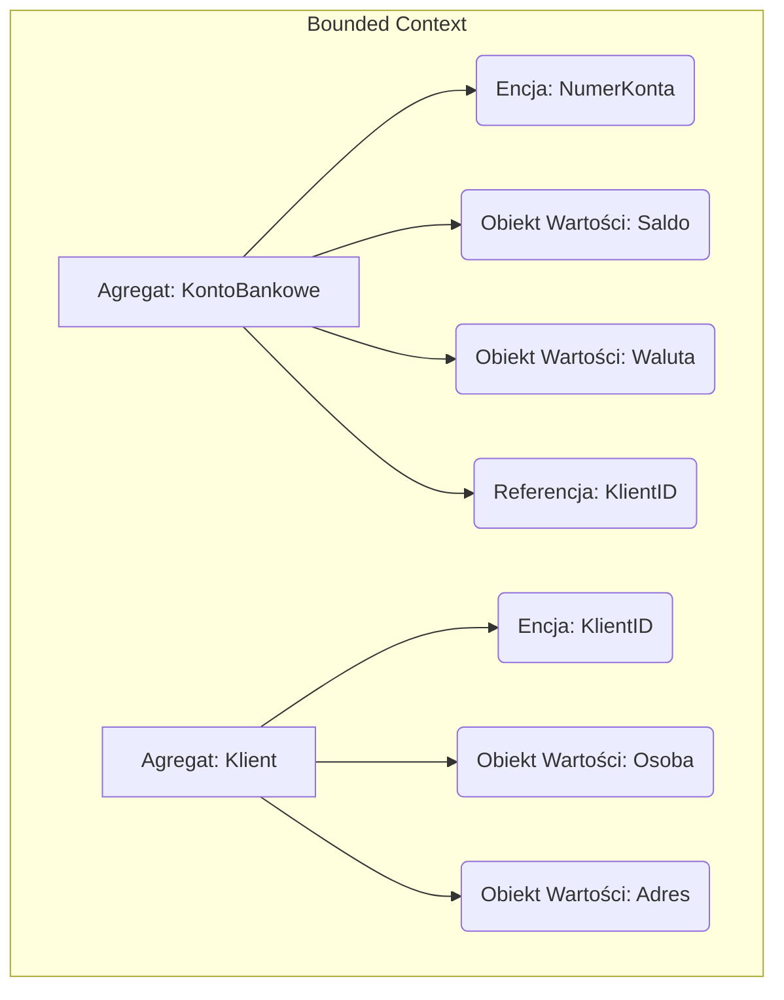

# Zadanie 1 - Domain Driven Design (DDD) - Fragment Aplikacji Bankowej

Celem tego zadania jest zastosowanie zasad **Domain Driven Design (DDD)** do zamodelowania wybranego fragmentu bezpiecznej aplikacji bankowej. Koncentruję się na kontekście **Zarządzanie Kontem i Klientem**, modelując kluczowe elementy takie jak **KontoBankowe** i **Klient** z towarzyszącymi im encjami i obiektami wartości.

---
## 1. Definicja Ograniczonego Kontekstu (Bounded Context)
Wybrany kontekst: **Zarządzanie Kontem i Klientem**.
Ten kontekst odpowiada za utrzymanie spójności danych konta, zarządzanie saldem, tworzenie i zamykanie kont oraz zarządzanie podstawowymi danymi osobowymi Klientów.

---
## 2. Obrazek Przedstawiający Model
Poniższy schemat przedstawia dwa główne **Agregaty (Roots)**, które są granicami spójności w tym kontekście: `KontoBankowe` i `Klient`.

## 3. Modelowanie Agregatów, Encji i Obiektów Wartości
Poniższa tabela przedstawia kluczowe elementy modelu wraz z atrybutami i ich rolą w DDD.

| Typ Elementu DDD | Nazwa        | Atrybuty / Skład                                                                                                              | Rola / Kluczowe Założenia                                                                                 |
| ---------------- | ------------ | ----------------------------------------------------------------------------------------------------------------------------- | --------------------------------------------------------------------------------------------------------- |
| AGREGAT (Root)   | KontoBankowe | * NumerKonta (Encja ID) * Saldo (Obiekt Wartości) * Waluta (Obiekt Wartości) * właścicielID (Referencja do KlientID) | Granica Spójności: Zapewnia integralność Salda. Wszystkie zmiany w Saldo muszą przejść przez ten Agregat. |
| AGREGAT (Root)   | Klient       | * KlientID (Encja ID) * Osoba (Obiekt Wartości) * Adres (Obiekt Wartości)                                               | Granica Spójności: Zapewnia integralność danych osobowych Klienta.                                        |
| ENCJA            | NumerKonta   | * NumerIBAN: string                                                                                                           | Musi być unikalny w całym systemie bankowym.                                                              |
| ENCJA            | KlientID     | * ID: string (UUID)                                                                                                           | Identyfikator wewnętrzny Agregatu Klient.                                                                 |
| OBIEKT WARTOŚCI  | Saldo        | * Kwota: decimal, związana walutą (string)                                                                                    | Kwota >= 0. Precyzja do 2 miejsc po przecinku. Jest niemutowalne (nowe Saldo jest tworzone po operacji).  |
| OBIEKT WARTOŚCI  | Adres        | * Ulica: string * NumerDomu: string * KodPocztowy: string * Miejscowość: string                                      | Traktowany jako całość. Nie można zmienić samego KodPocztowy.                                             |
| OBIEKT WARTOŚCI  | Osoba        | * Imię: string * Nazwisko: string * IdentyfikatorKrajowy: string (PESEL/NIP)                                            | IdentyfikatorKrajowy musi przejść walidację sumy kontrolnej.                                              |

## 4. Przyjęte Założenia, Ograniczenia i Operacje
| Element      | Format Danych / Ograniczenia                                                                                                                   | Przykładowe Operacje w Agregacie / Integracja                                                                                              |
| ------------ | ---------------------------------------------------------------------------------------------------------------------------------------------- | ------------------------------------------------------------------------------------------------------------------------------------------ |
| KontoBankowe | NumerIBAN: string, format PLxx xxxx xxxx... Kwota Salda: musi być w tej samej Walucie; nie może być ujemne (nie zakładam kont kredytowych). | Operacje: Wplac(Kwota, Waluta), Wyplac(Kwota, Waluta), ZablokujKonto().                                                                    |
| Klient       | IdentyfikatorKrajowy: 11 cyfr (PESEL) lub 10 cyfr (NIP). KodPocztowy: format xx-xxx.                                                        | Operacje: ZmienAdres(NowyAdres), ZmienDaneOsobowe(Osoba). Integracja: Agregat Klient publikuje Zdarzenie: AdresKlientaZmieniony.        |
| Kwoty        | Waluta: Kod ISO 4217 (np. PLN, EUR, USD). Wszelkie operacje muszą obsługiwać konwersję Walut.                                               | Ograniczenie: Kontekst Zarządzanie Kontem nie wykonuje logiki przelewu (np. weryfikacji odbiorcy). Logika ta należy do kontekstu Przelewy. |